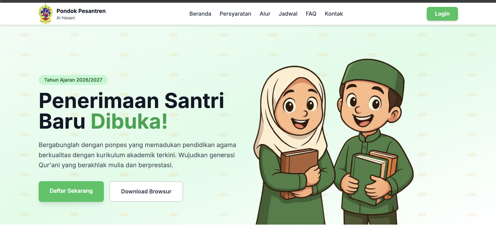

# Sistem Penerimaan Santri Baru (PSB)

**Sistem Penerimaan Santri Baru (PSB)** adalah platform digital yang dirancang untuk memudahkan proses pendaftaran dan seleksi calon santri di pondok pesantren secara **online, efisien, dan transparan**.  
Proyek ini dikembangkan menggunakan **Laravel (backend)** dan **Nuxt.js (frontend)** dengan desain antarmuka yang modern dan mobile-friendly.

Kunjungi Situs [PSB Al Hasani](https://psb.alhasani.id/)

## Tujuan Utama

1. **Digitalisasi Proses Pendaftaran**  
   Menghilangkan proses manual berbasis kertas dan memindahkannya ke sistem online yang mudah digunakan oleh calon santri dan panitia penerimaan.

2. **Transparansi & Akuntabilitas**  
   Menampilkan status pendaftaran, verifikasi dokumen, dan hasil seleksi secara real-time melalui portal masing-masing pengguna.

3. **Efisiensi Administrasi**  
   Otomatisasi berbagai tahapan administrasi seperti verifikasi data, jadwal tes, serta notifikasi pembayaran.

---

## Fitur Utama

- **Formulir Pendaftaran Multi-Step**  
  Pendaftaran dilakukan bertahap dengan validasi otomatis untuk memastikan data lengkap dan valid (termasuk verifikasi NIK 16 digit).

- **Manajemen Dokumen Wajib**  
  Calon santri dapat mengunggah dokumen (KK, Akta, Ijazah, dll) dengan status “pending”, “disetujui”, atau “ditolak”.

- **Portal Santri**  
  Setiap santri dan wali memiliki akun masing-masing untuk memantau status pendaftaran, jadwal ujian, dan pembayaran.

- **Dashboard Admin**  
  Menyediakan fitur bagi panitia untuk memverifikasi data, mengelola jadwal tes, dan mencetak laporan hasil seleksi.

- **Integrasi Pembayaran (Midtrans)**  
  Pembayaran biaya pendaftaran dapat dilakukan online dan otomatis terverifikasi dalam sistem.

## Teknologi yang Digunakan

| Komponen        | Teknologi Utama |
|-----------------|----------------|
| **Frontend**    | Nuxt.js, Tailwind CSS |
| **Backend**     | Laravel 10, Sanctum Auth |
| **Database**    | MySQL / MariaDB |
| **Deployment**  | Nginx, Docker, VPS Ubuntu |
| **Versioning**  | GitHub, CI/CD (Vercel / Laravel Forge) |

## Dampak & Manfaat

- Meningkatkan efisiensi panitia hingga **70%** dalam proses administrasi penerimaan.  
- Mempermudah calon santri dari berbagai daerah untuk mendaftar tanpa harus datang langsung.  
- Meningkatkan transparansi dan kepercayaan masyarakat terhadap sistem penerimaan.

## Kontributor

- **Ahmad Khoirul Fajeri** – FullStack Developer & System Architect  

## Lisensi

Proyek ini dikembangkan secara **in-house** untuk kebutuhan digitalisasi pesantren dan bersifat **proprietary** (tidak untuk distribusi publik tanpa izin).

> “Digitalisasi bukan hanya tentang teknologi, tetapi tentang efisiensi dan transparansi dalam pelayanan pendidikan pesantren.”

